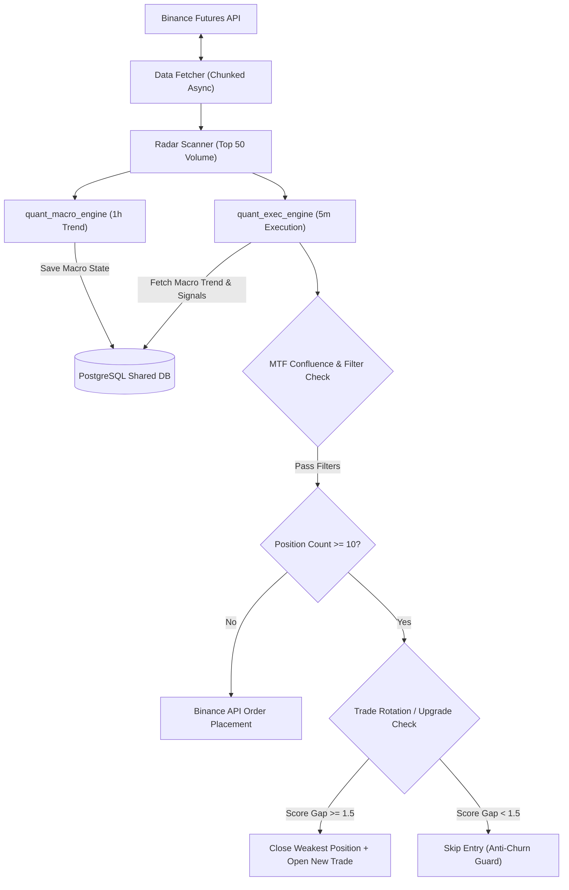

# الدليل الشامل لمنطق الخوارزمية والهندسة البرمجية للروبوت (Quant Trading Bot)

هذا المستند يشرح بالتفصيل الدقيق المنطق التداولي، النماذج الرياضية، ومعمارية النظام الكيميائية والبرمجية للروبوت التداولي الكمي (`Quant Execution Engine`). تم إعداد هذا الملف ليكون مرجعاً تقنياً شاملاً لأي مهندس كمي (Quantitative Developer) يطمح لفهم كيفية "تفكير" الروبوت واتخاذ القرارات البرمجية في الوقت الفعلي.

---

## 1. نظرة عامة على النظام (System Overview)

### 1.1 معمارية النظام (System Architecture)
يعمل النظام كمنظومة تداول آلية فائقة الأداء تعتمد على نظام الحاويات المنفصلة (Docker Microservices):

- **محرك التنفيذ (`quant_exec_engine`)**: يعمل على إطار زمني **5 دقائق (5m)** لتقييم الإشارات اليومية والسريعة وإدارتها.
- **محرك الاتجاه العام (`quant_macro_engine`)**: يعمل على إطار زمني **ساعة واحدة (1h)** لتحديد الاتجاه الكلي للسوق (Macro Trend) وتزويد محرك التنفيذ بالاتجاه الكلي.
- **قاعدة البيانات المشتركة (`quant_shared_db` - PostgreSQL)**: تستخدم لحفظ حالات المحفظة (PortfolioState)، الإشارات التداولية (TradingSignals)، السجلات التشغيلية (BotLog)، وحفظ رتب العملات النشطة.
- **الربط مع منصة Binance Futures**: يتم تنفيذ الأوامر من خلال API الخاص بـ Binance Futures Testnet/Live عبر بيئة آمنة تضمن الحفاظ على الهامش ومنع الصفقات المكررة.



---

## 2. دورة حياة الصفقة (The Bot's Workflow)

تتم عملية التداول في كل دورة زمنية (تُنفذ كل 5 دقائق) وفق الخطوات الترتيبية التالية:

1. **المسح الديناميكي للسوق (Radar Scanner)**:
   - يقرأ الروبوت قائمة بيضاء موسعة تحتوي على أكثر من 60 عملة USDT Perpetual حقيقية وعالية السيولة (`REAL_WORLD_WHITELIST`).
   - يقوم ماسح الـ Radar بتصفية أعلى 50 عملة من حيث حجم التداول خلال 24 ساعة (`24h Quote Volume`) لضمان التداول على العملات الأكثر حركة وسيولة فقط، مع استبعاد العملات وهمية التداول.

2. **جلب البيانات وتجميع الشموع (Chunked Candle Fetcher)**:
   - يجلب الروبوت 250 شمعة بفاصل 5m لكل عملة من الـ 50 عملة.
   - لضمان عدم تجاوز حدود الاستخدام الخاصة بـ Binance API (`HTTP 429 Rate Limits`)، يتم استخدام `ThreadPoolExecutor` لمعالجة الطلبات في مجموعات متوازية (Chunks of 10) مع فاصل زمني آمن قدره 0.15 ثانية بين المجموعات.

3. **تحليل الاتجاه متعدد الأطر الزمنية (MTF Confluence Analysis)**:
   - يقرأ محرك التنفيذ اتجاه الـ Macro المحدث من إطار الـ 1h (`UPTREND` أو `DOWNTREND` أو `NEUTRAL`).
   - لا يُسمح بفتح صفقة LONG إلا إذا كان الاتجاه العام صاعداً أو محايداً، ولا يُسمح بفتح صفقة SHORT إلا إذا كان الاتجاه العام هابطاً أو محايداً.

4. **توليد الإشارات والتأكد من الفلاتر**:
   - يحسب الروبوت المؤشرات الإحصائية (Z-Score، RSI، Order Blocks، Volume Ratio).
   - يتم التأكد من عدم تواجد RSI في منطقة الذبذبة الضيقة (Chop Zone: 45 - 55).

5. **فحص حدود المحفظة وإعادة تدوير الصفقات (Position Rotation Guard)**:
   - يتم التحقق من عدد الصفقات المفتوحة حالياً مقارنة بـ `MAX_GLOBAL_POSITIONS` (المحدد بـ 10 صفقات).
   - في حال كانت المحفظة ممتلئة (10/10)، يتم تفعيل خوارزمية **Trade Upgrading**: يتم تقييم درجة قوة الصفقة الجديدة مقارنة بأضعف صفقة مفتوحة حالياً. إذا كانت الصفقة الجديدة أقوى بفارق `+1.5` في الـ Strength Score، يتم إغلاق الصفقة الضعيفة فوراً وفتح الصفقة القوية الجديدة.

6. **التنفيذ وحفظ الحالة**:
   - يتم تحديد حجم المركز بناءً على مستويات الثقة (Conviction Tiers) مع تطبيق سقف محدد للخطورة (`MAX_POSITION_USDT = $250`).
   - يتم حساب ونقل الـ Stop Loss تلقائياً ومزامنتها في قاعدة البيانات مع إرسال إشعارات لحظية عبر Telegram.

---

## 3. استراتيجيات التداول (Trading Strategies)

يحتوي الروبوت على استراتيجيتين رئيسيتين للتداول اعتنامداً على سلوك السعر والحجم:

### 3.1 استراتيجية السحب / الارتداد (Strategy A: Pullback Strategy)
تستهدف هذه الاستراتيجية الشراء عند الارتداد إلى مناطق الدعم المؤسسي (Order Blocks) أثناء الاتجاه الصاعد، أو البيع عند الارتداد لمناطق المقاومة أثناء الاتجاه الهابط.

- **الشراء (Pullback LONG)**:
  - الاتجاه العام: `UPTREND`.
  - انخفاض انحراف السعر الإحصائي: `Z-Score < -1.2` (السعر في منطقة تشبع بيعي مؤقت بالنسبة للمتوسط).
  - ملامسة منطقة طلب مؤسسية صاعدة (`Bullish Order Block`).
  - تأكيد الزخم: `RSI > 55`.

- **البيع (Pullback SHORT)**:
  - الاتجاه العام: `DOWNTREND`.
  - ارتفاع انحراف السعر الإحصائي: `Z-Score > +1.2` (السعر في منطقة تشبع شرائي مؤقت بالنسبة للمتوسط).
  - ملامسة منطقة عرض مؤسسية هابطة (`Bearish Order Block`).
  - تأكيد الزخم: `RSI < 45`.

---

### 3.2 استراتيجية الاختراق (Strategy B: Breakout Strategy)
تستهدف الدخول مع قوة الاختراق الهيكلي لمناطق التجميع والـ Consolidation المصحوبة بحجم تداول ضخم.

- **اختراق صاعد (Breakout LONG)**:
  - اختراق أعلى قمة خلال فترة التجميع (`Consolidation High`).
  - `Z-Score > +1.2` مع زاوية ارتفاع حادة.
  - حجم التداول في شمعة الاختراق $\ge 2.0\times$ متوسط حجم 20 شمعة سابق.
  - `RSI > 55`.

- **اختراق هابط (Breakout SHORT)**:
  - كسر أدنى قاع خلال فترة التجميع (`Consolidation Low`).
  - `Z-Score < -1.2` مع انحدار شديد.
  - حجم التداول في شمعة الكسر $\ge 2.0\times$ متوسط حجم 20 شمعة سابق.
  - `RSI < 45`.

---

### 3.3 استراتيجية اصطياد الحيتان (Strategy C: Whale Hunter)
تستهدف هذه الاستراتيجية صيد الانفجارات السعرية الناتجة عن تدفقات السيولة المؤسسية الضخمة (Volume Anomalies) بشكل مباشر ومستقل.

- **شرط صيد الحوت (Whale Strike Condition)**:
  - حجم تداول شمعة الـ 5m الحالية ضخم جداً ويساوي أو يتجاوز **10 أضعاف ($\ge 10.0\times$)** متوسط حجم التداول لـ 50 شمعة سابقة (`WHALE_VOLUME_MULTIPLIER = 10.0`).
- **التجاوز الاستثنائي للفلاتر (Filter Bypass)**:
  - تتجاوز هذه الاستراتيجية قيود الـ Z-Score المعتادة وفلتر منطقة التذبذب لـ RSI (Chop Zone: 45-55)، لأن التدفقات السيولية الضخمة تخلق زخمها الخاص واختراقها الذاتي.
- **شرط الدخول**:
  - **Whale Strike LONG**: شمعة صاعدة قوية (`Close > Open`) + حجم $\ge 10.0\times$ + الاتجاه العام صاعد أو محايد (`UPTREND`/`NEUTRAL`).
  - **Whale Strike SHORT**: شمعة هابطة قوية (`Close < Open`) + حجم $\ge 10.0\times$ + الاتجاه العام هابط أو محايد (`DOWNTREND`/`NEUTRAL`).

---

### 3.4 مناطق الطلب والعرض المفلترة بحجم التداول (Volume-Filtered Order Blocks)
لا يُعتبر أي كتلة طلب أو عرض ذات قيمة ما لم تكن مصحوبة باندفاع قاطعة في حجم التداول (Institutional Volume).

```python
# كود حساب الـ Order Block المفلتر بحجم التداول في analyzer.py
vol_sma20 = df['volume'].rolling(window=20).mean()
df['vol_ratio'] = df['volume'] / vol_sma20

# Bullish Order Block: شمعة حمراء سبقت اندفاعة شرائية ضخمة (Vol Ratio >= 1.5)
is_bullish_ob = (df['close'].shift(1) < df['open'].shift(1)) & \
                (df['close'] > df['open']) & \
                (df['vol_ratio'] >= 1.5)
```

---

## 4. شروط الدخول والفلترة (Entry Criteria & Filters)

### 4.1 الدرجة المعيارية (Z-Score)
تُعد الـ **Z-Score** المحرك الإحصائي الأساسي لقياس مدى الابتعاد القياسي لسعر الإغلاق الحالي عن المتوسط المتحرك البسيط (SMA-50) مقاساً بالانحراف المعياري ($\sigma$).

#### المعادلة الرياضية:
$$\text{Z-Score} = \frac{P_{\text{close}} - \text{SMA}_{50}(P)}{\sigma_{50}(P)}$$

حيث:
- $P_{\text{close}}$: سعر الإغلاق الحالي للشمعة.
- $\text{SMA}_{50}(P)$: المتوسط المتحرك البسيط لآخر 50 شمعة.
- $\sigma_{50}(P)$: الانحراف المعياري لأسعار الإغلاق لآخر 50 شمعة.

```python
# تنفيذ الـ Z-Score في البرمجية
mean = df['close'].rolling(window=50).mean()
std = df['close'].rolling(window=50).std()
df['zscore'] = (df['close'] - mean) / std
```

#### تفسير العتبات (Thresholds):
- **$Z > +1.2$**: يمثل انحرافاً إيجابياً قوياً. يُستخدم لتأكيد الشراء في حالات الاختراق (Breakout LONG) أو لتأكيد البيع الارتدادي (Pullback SHORT).
- **$Z < -1.2$**: يمثل انحرافاً سلبياً قوياً. يُستخدم لتأكيد الشراء الارتدادي (Pullback LONG) أو لتأكيد البيع في حالات الكسر (Breakout SHORT).

---

### 4.2 فلتر منطقة الذبذبة لـ RSI (RSI Chop Zone Filter)
لتجنب الدخول في الأسواق العرضية العديمة الاتجاه (Chop/Sideways Market)، يفرض الروبوت شرطاً صقرياً لمؤشر القوة النسبية (RSI-14):

- **منطقة المحظور (Chop Zone)**: $45.0 \le \text{RSI} \le 55.0$. تُرفض جميع الإشارات التداولية داخل هذه المنطقة نهائياً.
- **شرط الشراء (LONG)**: يشتد التداول فقط عندما تكون الزخم صاعداً بشكل واضح: $\text{RSI} > 55.0$.
- **شرط البيع (SHORT)**: يشتد التداول فقط عندما يكون الزخم هابطاً بشكل واضح: $\text{RSI} < 45.0$.

---

### 4.3 توافق الاتجاه الكلي (Macro Trend Alignment)
يقوم محرك الـ Macro بالتأكد من اتجاه السوق ككل على إطار 1h لحماية المحفظة من التداول عكس الاتجاه السائد:

$$\text{Macro Trend} = \begin{cases} 
\text{UPTREND} & \text{if } \text{Z-Score}_{1h} > 0 \text{ and } \text{SMA}_{50}(1h) \text{ sloping UP} \\
\text{DOWNTREND} & \text{if } \text{Z-Score}_{1h} < 0 \text{ and } \text{SMA}_{50}(1h) \text{ sloping DOWN} \\
\text{NEUTRAL} & \text{otherwise}
\end{cases}$$

---

## 5. إدارة المخاطر وحجز الأرباح (Risk & Position Management)

### 5.1 وقف الخسارة الأولي (Initial Stop Loss)
عند فتح أي صفقة جديدة، يتم تحديد الـ Stop Loss فوراً وتثبيته لحماية رأس المال:
- صفقة الـ LONG: يُحدد الـ SL عند أدنى سعر لـ Order Block السفلية أو بحد أقصى بنسبة **5%** أسفل سعر الدخول (`HARD_STOP_LOSS_PCT = 0.05`).
- صفقة الـ SHORT: يُحدد الـ SL عند أعلى سعر لـ Order Block العلوي أو بحد أقصى بنسبة **5%** أعلا سعر الدخول.

> [!IMPORTANT]
> **إصلاح ثغرة مزامنة الـ Stop Loss**: تم تطوير آلية الحفظ والـ Sync مع منصة Binance بحيث لا يتم مسح أو كتابة `NULL` على سعر الـ Stop Loss الموجود في قاعدة البيانات المحلية أثناء عمليات المزامنة الدورية للحساب.

---

### 5.2 وقف الخسارة المتحرك وحفظ الأرباح (Trailing Stop Loss - TSL)

يعتمد الروبوت على نموذج العلامة المائية الفائقة (Watermark Mechanism) لحماية الأرباح وتتبع السعر القومي:

#### 1. تتبع أعلى / أدنى سعر منذ الدخول (High/Low Watermark):
- في صفقات الـ **LONG**: يتم تحديث `highest_price_since_entry = max(highest_price, current_price)`.
- في صفقات الـ **SHORT**: يتم تحديث `lowest_price_since_entry = min(lowest_price, current_price)`.

#### 2. شرط تفعيل الـ TSL:
لا يتفعل الوقف المتحرك إلا بعد أن تحقق الصفقة أرباحاً غير محققة (Unrealized PnL) لا تقل عن **+1.5%** (`TRAILING_ACTIVATE_PCT = 0.015`).

#### 3. مسافة التتبع (Trailing Distance):
بمجرد التفعيل، يتحرك الـ Stop Loss خلف أعلى قمة حققها السعر بمسافة **1.0%** (`TRAILING_DISTANCE_PCT = 0.01`).

```python
# كود حساب الـ Trailing Stop Loss في analyzer.py لصفقة LONG
unrealized_pnl_pct = ((current_price - entry_price) / entry_price) * 100.0

if unrealized_pnl_pct >= 1.5:  # تفعيل الـ TSL
    trailing_sl = highest_price_since_entry * (1.0 - 0.01)
    if current_stop_loss is None or trailing_sl > current_stop_loss:
        current_stop_loss = trailing_sl  # رفع وقف الخسارة لحماية الأرباح
```

---

### 5.3 إعادة تدوير الصفقات والترقية الذكية (Trade Upgrading & Position Rotation)

عندما تصل المحفظة للحد الأقصى المسموح به من الصفقات المفتوحة (`MAX_GLOBAL_POSITIONS = 10`) وظهرت إشارة تداول جديدة ممتازة، لا يقوم الروبوت بتجاهلها، بل يطبق خوارزمية **Position Rotation**:

#### 1. نظام قياس قوة الصفقة (Strength Score):
يتم قياس قوة الإشارة الجديدة وجميع الصفقات المفتوحة حالياً بناءً على الانحراف الإحصائي ومعامل حجم التداول:

$$\text{Strength Score} = |Z| \times \left(1.0 + 0.1 \times \min(\max(V_{\text{ratio}}, 1.0), 5.0)\right)$$

#### 2. كشف الصفقات الخاملة (Stagnant Trades):
الصفقة المفتوحة منذ أكثر من **ساعتين ($\ge 2.0$ hours)** ولم تحقق أرباحاً تذكر ($\text{PnL} < 0.5\%$) تُصنف فوراً كـ `STAGNANT` وتأخذ **Strength Score = 0.0**، مما يجعلها المرشح الأول للإغلاق والاستبدال.

#### 3. العتبة الوقائية لمنع الاستبدال العشوائي (Anti-Churn Upgrade Threshold):
لحماية الحساب من دفع عمولات تداول زائدة لمنصة Binance دون فائدة، يُشترط لاستبدال الصفقة أن تكون قوة الإشارة الجديدة أعلى من أضعف صفقة حالية بفارق لا يقل عن **+1.5**:

$$\text{Should Upgrade} = \begin{cases} 
\text{True} & \text{if } \text{Weakest Trade is STAGNANT} \\
\text{True} & \text{if } \text{Candidate Score} \ge \text{Weakest Score} + 1.5 \\
\text{False} & \text{otherwise (Skip Entry)}
\end{cases}$$

#### 4. التنفيذ البرمجي لعملية الترقية:
عند تحقق شرط الترقية:
1. يتم إغلاق الصفقة الضعيفة على Binance وفي قاعدة البيانات وتوثيق سبب الإغلاق كـ `exit_reason = POSITION_UPGRADE`.
2. يتم تحرير الهامش وقاطعة الـ DB المخصصة للصفقة.
3. يتم إرسال تنبيه عبر Telegram وتنفيد الصفقة الجديدة فوراً.

---

## 6. ملخص محددات الإعدادات (Core Configuration Summary)

| المعلمة (Parameter) | القيمة (Value) | الوصف (Description) |
| :--- | :--- | :--- |
| `TIMEFRAME` | `5m` | الإطار الزمني الرئيسي لمحرك التنفيذ |
| `MAX_GLOBAL_POSITIONS` | `10` | الحد الأقصى للصفقات المفتوحة بالتوازي على Binance |
| `ZSCORE_LONG_THRESHOLD` | `-1.2` | عتبة الانحراف المعياري لصفقات الشراء |
| `ZSCORE_SHORT_THRESHOLD` | `+1.2` | عتبة الانحراف المعياري لصفقات البيع |
| `RSI_CHOP_MIN` / `MAX` | `45` - `55` | منطقة التذبذب العرضي المحظورة للتداول |
| `HARD_STOP_LOSS_PCT` | `5.0%` | أقصى نسبة لوقف الخسارة الأولي |
| `TRAILING_ACTIVATE_PCT` | `1.5%` | نسبة الربح المطلوبة لتفعيل الـ Trailing Stop Loss |
| `TRAILING_DISTANCE_PCT` | `1.0%` | مسافة وقف الخسارة المتحرك من الذروة |
| `UPGRADE_SCORE_GAP` | `+1.5` | الفارق المطلوب في درجة القوة لتفوق صفقة جديدة واستبدال الصفقة الضعيفة |

---
*تم توليد هذا الملف وتحديثه تلقائياً ليكون الدليل التوثيقي الرسمي لهندسة الروبوت التداولي الكمي.*
